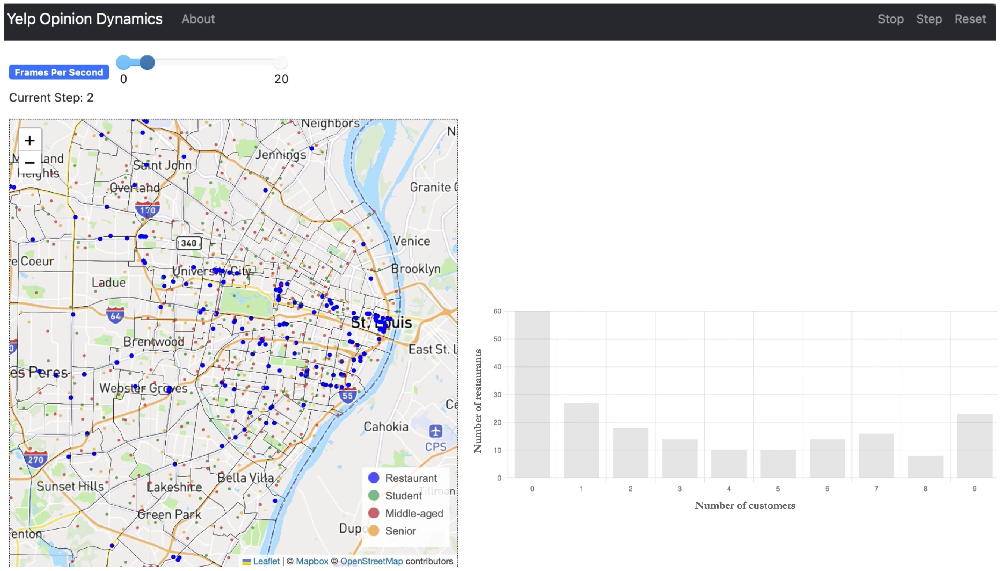
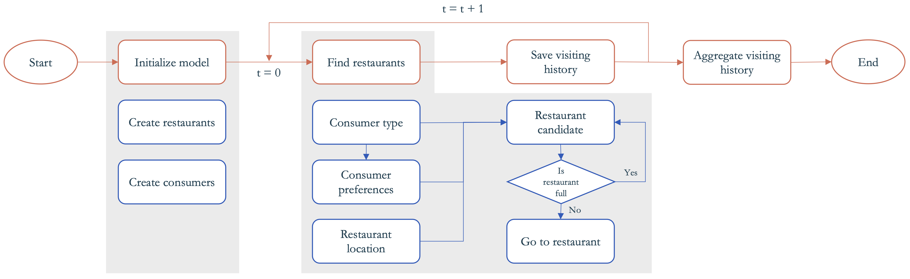

Yelp Opinion Dynamics Model
===========================



## Summary



This is an agent-based model to simulate consumer agents and their restaurant visiting patterns.

During model initialization, restaurants are created with locations using information from Yelp, along with their average sentiment scores from a pre-trained language model. Consumer agents are created at random places with a random attribute (i.e., student, middle-aged, or senior), which subsequently determines their restaurant preferences. For example, student agents are more sensitive to the price factor, whereas senior agents prefer restaurants with higher ambience score.

At each step, consumer agents are informed by the language model results and visit the best restaurant based on their preferences. We also implement a null model in which consumer agents make random decisions on which restaurant to visit.

### GeoSpace

The City of St. Louis, MO.

### GeoAgent

**Restaurant agents:** each restaurant has a location and sentiment scores on four choice factors: food, service, price, and ambience, estimated from a pre-traind language model on text reviews from Yelp.

**Consumer agents:** each consumer has a random location and a preference on the four choice factors. The preference is determined by the consumer's attribute (i.e., student, middle-aged, or senior).

## How to run

To install the dependencies:

```bash
python3 -m pip install -r requirements.txt
```

To run the model interactively, run `mesa runserver` in this directory. e.g.

```bash
mesa runserver
```

Then open your browser to [http://127.0.0.1:8521/](http://127.0.0.1:8521/) and press `Start`.